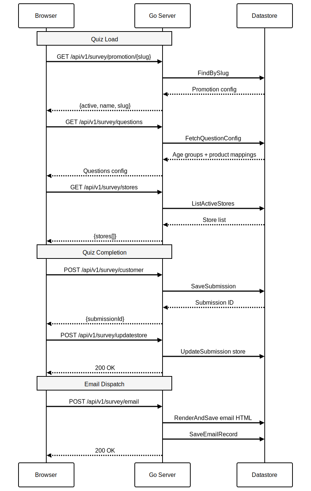

# Azadi Landing

A skincare quiz platform for Azadi in-store promotions. Customers complete a short quiz (age, skin type, concerns),
receive a personalised product recommendation and voucher, and are directed to their nearest store. The backend handles
quiz config, submissions, email dispatch, and a CMS-style admin panel.

Two quiz implementations exist: **2015** (legacy, jquery based) and **2026** (modern rewrite
with ES modules and WAAPI animations). Both are served as static files from the same build.

---

## Table of Contents

- [Architecture Overview](#architecture-overview)
- [Project Structure](#project-structure)
- [Running Locally](#running-locally)
- [Getting Started](#getting-started)
- [Frontend Development](#frontend-development)
- [Backend Development](#backend-development)
- [Dev Container](#dev-container)
- [Environment Variables](#environment-variables)
- [Admin Panel](#admin-panel)
- [API Reference](#api-reference)
- [Design Decisions](#design-decisions)

---

## Architecture Overview

<p align="center">
  
</p>

> Diagram source: [`diagrams/01-architecture-overview.mmd`](diagrams/01-architecture-overview.mmd)

Firebase Hosting serves the built static frontend (`frontend/dist`) and proxies a handful of routes (`/api/**`,
`/admin/**`, `/login`, `/logout`) to the Go server on Cloud Run. Everything else is a CDN cache hit.

The Go server owns all data — no direct database access from the browser.

### Survey Flow

<p align="center">
  
</p>

> Diagram source: [`diagrams/02-survey-flow.mmd`](diagrams/02-survey-flow.mmd)

---

## Project Structure

```
amazing-landing/
├── backend/
│   ├── cmd/server/         # Entrypoint (main.go)
│   ├── internal/
│   │   ├── admin/          # Admin panel handlers (stores, promotions, submissions, products, questions, users)
│   │   ├── auth/           # Session store, login tracker, rate limiter, admin auth
│   │   ├── config/         # Config loaded from env
│   │   ├── email/          # Email rendering + preview handler
│   │   ├── middleware/      # HTTP middleware
│   │   ├── model/          # Data models (Submission, Store, Promotion, Product, QuestionConfig, AdminUser)
│   │   ├── repo/           # Generic Datastore repository
│   │   ├── seed/           # Seed data loader (dev only)
│   │   ├── server/         # HTTP mux + template loading + Vite manifest
│   │   └── survey/         # Quiz API handlers + repositories
│   ├── seed/               # Seed JSON files (stores, promotions, products, admin)
│   ├── templates/          # Go HTML templates (admin panel + login + change-password)
│   ├── Dockerfile          # Multi-stage build (golang:1.24-alpine → alpine:3.21)
│   ├── local.env           # Dev environment variables
│   └── go.mod
├── frontend/
│   ├── 2026/
│   │   ├── desktop/        # Modern desktop quiz (ES modules, WAAPI, component-based)
│   │   └── mobile/         # Mobile variant
│   ├── 2015/
│   │   ├── desktop/        # Legacy desktop quiz (vanilla JS scripts)
│   │   └── mobile/         # Legacy mobile variant
│   ├── admin/              # Admin SPA (Vite)
│   ├── mock-api/           # Static JSON responses for frontend-only development
│   ├── assets/             # Shared images and libraries
│   ├── vite.config.js      # Builds all four quiz variants into dist/
│   └── package.json
├── .devcontainer/          # Dev container (Go, Node, gcloud, Claude Code)
├── diagrams/               # Architecture diagrams (.mmd source + .svg renders)
└── firebase.json           # Hosting config + Cloud Run rewrites
```

---

## Running Locally

Everything runs on your machine — no cloud connection needed. Four processes, each in its own terminal.

### Ports at a glance

| Port   | Process                        | URL                         |
|--------|--------------------------------|-----------------------------|
| `:8081`| Firestore (Datastore) emulator | —                           |
| `:4000`| Firebase emulator UI           | http://localhost:4000       |
| `:8080`| Go backend (main entry point)  | http://localhost:8080       |
| `:3000`| Quiz frontend (Vite HMR)       | http://localhost:3000       |
| `:5173`| Admin panel (Vite HMR)         | http://localhost:8080/admin |

### Terminal 1 — Firestore emulator

```bash
# Inside dev container (alias)
fb-emulator

# Outside dev container
gcloud emulators firestore start \
  --host-port=0.0.0.0:8081 \
  --database-mode=datastore-mode \
  --project=demo-azadi
```

Leave this running. The emulator UI at http://localhost:4000 lets you browse and delete entities.

### Terminal 2 — Go backend

```bash
# Inside dev container (alias — includes hot reload via air)
azadi-dev

# Outside dev container
cd backend
set -a && source local.env && set +a
DATASTORE_EMULATOR_HOST=localhost:8081 air
```

The backend seeds all data automatically on first start (`SEED_DATA=true` in `local.env`). Visit http://localhost:8080 once it prints `listening on :8080`.

Admin panel: http://localhost:8080/admin — log in with `admin@azadi.com` / `changeme123`, or use the **Login as Admin** shortcut on the login page.

### Terminal 3 — Quiz frontend (optional, only when editing quiz UI)

```bash
# Inside dev container (alias)
azadi-frontend

# Outside dev container
cd frontend && npm run dev
```

Opens the quiz at http://localhost:3000. This is only needed when actively editing quiz HTML/JS — the backend already serves the built quiz at http://localhost:8080.

### Terminal 4 — Admin panel CSS/JS (optional, only when editing admin UI)

```bash
cd frontend/admin
npm run build -- --watch
```

Rebuilds `frontend/admin/dist/` on every save. Hard-refresh the browser after each rebuild — there is no HMR for the admin panel in build-watch mode.

Alternatively, run `npm run dev` (Vite dev server on `:5173`) — but you must then access the admin via the Vite URL, not via the Go backend. Build-watch is simpler for most admin UI work.

### Frontend + real backend (full-stack testing)

```bash
cd frontend && npm run build   # build once (or use --watch)
```

Then open **http://localhost:8080** (redirects to `/2026/desktop/`).

The Go backend serves the built quiz from `frontend/dist/` and handles all API calls via the real Go handlers + Datastore emulator. No mock, no toggles. Other quiz variants: `/2015/desktop/`, `/2026/mobile/`, `/2015/mobile/`.

Admin panel: **http://localhost:8080/admin** — log in with `admin@azadi.com` / `changeme123`.

### Frontend only (no backend needed)

Open **http://localhost:3000** (requires Terminal 3).

The Vite dev server serves the quiz with hot-module reload. API calls are intercepted by a Vite middleware plugin (`mockApi` in `vite.config.js`) and served from static JSON files in `mock-api/`. No Go backend or emulator required.

### Summary

| What you want to do                 | URL                                     | Backend required? |
|-------------------------------------|-----------------------------------------|-------------------|
| Test quiz with real API + Datastore | http://localhost:8080/2026/desktop/     | Yes               |
| Edit quiz UI with live reload       | http://localhost:3000                   | No (mock API)     |
| Test admin panel                    | http://localhost:8080/admin             | Yes               |
| Browse emulator data                | http://localhost:4000                   | Emulator only     |
| Hit API directly (curl)             | http://localhost:8080/api/v1/survey/... | Yes               |

### Re-seeding

The seeder runs once and then skips on restart. To wipe and re-seed:

```bash
curl -X POST http://localhost:8081/reset   # wipes emulator data
# then restart Terminal 2
```

---

## Getting Started

### Prerequisites

- Docker and Docker Compose
- VS Code with the Dev Containers extension

### Quick Start

```bash
git clone <repo-url> && cd amazing-landing
code .
# VS Code prompts "Reopen in Container" — click it
```

The container installs Go, Node, gcloud CLI, the Firestore emulator, and all dependencies on first create. 
Open three terminals inside the container:

```bash
# Terminal 1 — Firestore emulator
fb-emulator

# Terminal 2 — Frontend (Vite HMR on :3000)
cd /workspace/frontend && npm run dev

# Terminal 3 — Go server (:8080 with hot reload via air)
cd /workspace/backend && set -a && source local.env && set +a && DATASTORE_EMULATOR_HOST=localhost:8081 air
```

Open `http://localhost:8080`. The server seeds stores, promotions, and products automatically on first start (`SEED_DATA=true` in `local.env`).

<p align="center">
  
</p>

> Diagram source: [`diagrams/03-dev-workflow.mmd`](diagrams/03-dev-workflow.mmd)

---

## Frontend Development

The frontend does not require the backend running. 
The `mock-api/` directory contains static JSON responses matching the survey API contract.

### Frontend-only workflow

```bash
cd frontend
npm install
npm run dev
```

Vite opens `http://localhost:3000/2026/desktop/index.html`. 
API calls to `/api/v1/survey/*` are intercepted by the Vite dev server middleware and served from `mock-api/` JSON files — no backend needed.

### Building

```bash
npm run build   # outputs frontend/dist/
```

The build produces four bundles under `dist/`: `2026-desktop`, `2026-mobile`, `2015-desktop`, `2015-mobile`. Firebase Hosting serves from `dist/`.

### 2026 vs 2015

|           | 2026                                            | 2015                                        |
|-----------|-------------------------------------------------|---------------------------------------------|
| JS style  | ES modules, class-based pages, WAAPI animations | Script-per-page, jQuery-style globals       |
| Entry     | `src/main.js` bootstraps a page router          | `azadi.js` wires up individual scripts  |
| Animation | Web Animations API (`core/animate.js`)          | CSS transitions + inline style manipulation |
| Build     | Vite with `rollupOptions` multi-entry           | Same Vite build, separate input             |


### Quiz Pages (2026)

| Page      | Class           | Description                                                    |
|-----------|-----------------|----------------------------------------------------------------|
| Landing   | `LandingPage`   | Promotion check, entry animation                               |
| Questions | `QuestionsPage` | Age, skin type, concerns — driven by `QuestionConfig` from API |
| Results   | `ResultsPage`   | Product reveal, customer form, store locator, hero transition  |
| Voucher   | `VoucherPage`   | Voucher display + email dispatch                               |

---

## Backend Development

The backend is a standard Go `net/http` server. No framework. Routes are registered in `internal/server/server.go`.

### Running without the dev container

```bash
cd backend

# Start the Firestore emulator (requires gcloud CLI + Firestore emulator component)
gcloud emulators firestore start --host-port=0.0.0.0:8081 \
  --database-mode=datastore-mode --project=demo-azadi

# In a second terminal
set -a && source local.env && set +a
DATASTORE_EMULATOR_HOST=localhost:8081 go run ./cmd/server
```

### Tests

```bash
cd backend
go test ./...
```

Tests are unit-only. The `auth` and `model` packages have the most coverage. Use `-short` to skip any slow tests.

### Adding a new API endpoint

1. Add handler method to the relevant package in `internal/` (e.g. `survey/handler.go`).
2. Register the route in `internal/server/server.go` → `Handler()`.
3. If it requires admin auth, wrap with `requireAdmin(...)`.

### Seed data

On startup with `SEED_DATA=true`, the seeder reads JSON from `backend/seed/` and writes to Datastore. It is idempotent — a `SeedMarker` entity prevents re-seeding on restart.

To force a full re-seed (e.g. after adding `questions.json`):

```bash
# 1. Reset the emulator (wipes all data)
curl -X POST http://localhost:8081/reset

# 2. Restart the backend — seeder runs automatically
cd backend && set -a && source local.env && set +a && go run ./cmd/server
```

Seed files:

| File                     | Contents                                        |
|--------------------------|-------------------------------------------------|
| `seed/stores.json`       | Store locations with coordinates                |
| `seed/promotions.json`   | Promotions with slugs                           |
| `seed/products.json`     | Product recommendations (Divine, Pivoine, etc.) |
| `seed/questions.json`    | Quiz config — age groups, skin types, concerns, product mapping |
| `seed/admin.json`        | Demo admin user (`admin@azadi.com` / `changeme123`) |

With `DEMO_MODE=true` (default in `local.env`), the seeded admin has `MustChangePassword: false` and a **Login as Admin** shortcut appears on the login page.

### Verify seed with curl

```bash
# Promotion
curl http://localhost:8080/api/v1/survey/promotion/default

# Stores (8 locations)
curl http://localhost:8080/api/v1/survey/stores

# Products (Divine, Pivoine, Precious, Shea)
curl http://localhost:8080/api/v1/survey/products

# Questions (age groups, skin types, concerns, product mapping)
curl http://localhost:8080/api/v1/survey/questions
```

---

## Dev Container

The dev container is defined in `.devcontainer/`. It runs a single service:

| Service | Image                               | Purpose                       |
|---------|-------------------------------------|-------------------------------|
| `app`   | Custom (`.devcontainer/Dockerfile`) | Go, Node, gcloud, Claude Code |

The `azadi-go` project is also mounted at `/workspace/azadi-go` (from `~/Desktop/projects/azadi-go`) so both projects share the same container.

### Shell aliases (registered in `~/.zshrc` by `post-create.sh`)

| Alias               | Command                             |
|---------------------|-------------------------------------|
| `fb-emulator`       | Start Firestore emulator on `:8081` |
| `fb-emulator-reset` | Kill and restart the emulator       |
| `azadi-dev`         | Start azadi-go with hot reload      |
| `azadi-frontend`    | Start azadi-go Vite dev server      |
| `azadi-test`        | Run azadi-go tests                  |

Claude Code is available as `claude` inside the container (with `--dangerously-skip-permissions` set by default in the alias).

---

## Environment Variables

All variables are read in `backend/internal/config/config.go`. Copy `backend/local.env` for local development — it is pre-populated with safe dev defaults.

| Variable                  | Default                            | Description                                               |
|---------------------------|------------------------------------|-----------------------------------------------------------|
| `PORT`                    | `8080`                             | HTTP listen port                                          |
| `ENVIRONMENT`             | `dev`                              | `dev` enables text logging and seed data                  |
| `GCP_PROJECT_ID`          | `demo-azadi`                       | Datastore project ID                                      |
| `ENCRYPTION_KEY`          | `dev-only-key-change-in-prod-32ch` | AES-GCM session encryption key (32 bytes)                 |
| `VITE_DEV_URL`            | _(empty)_                          | Vite dev server URL — enables Vite asset injection in dev |
| `SEED_DATA`               | `true`                             | Auto-seed on startup                                      |
| `ADMIN_EMAIL`             | `admin@azadi.com`                  | Initial admin email                                       |
| `ADMIN_PASSWORD_HASH`     | _(empty)_                          | Bcrypt hash of admin password                             |
| `FRONTEND_DIR`            | `../frontend`                      | Path to built frontend assets                             |
| `ADMIN_ASSETS_DIR`        | `../frontend/admin/dist`           | Path to built admin SPA assets                            |
| `DATASTORE_EMULATOR_HOST` | _(unset)_                          | Set to `localhost:8081` to use the local emulator         |

In production, `ENVIRONMENT` is anything other than `dev`, logging switches to JSON, and `SEED_DATA` is `false`.

---

## Admin Panel

The admin panel lives at `/admin` and requires session authentication. 
It is a server-rendered Go HTML template app with a Vite-built SPA for the frontend assets.

The Go server serves `admin/dist/` at `/assets/`. The admin CSS and JS must be built before the backend can serve them — there is no Vite proxy in dev; the backend always reads from `dist/`.

### Styling

CSS source lives in `frontend/admin/src/css/`. It uses plain CSS with `@layer` and custom properties (tokens defined in `tokens.css`). Class naming: `o-*` layout, `c-*` components, `t-*` typography, `u-*` utilities.

### Dev workflow

```bash
cd frontend/admin
npm install
npm run build -- --watch   # rebuilds dist/ on every save
```

Then restart the Go backend once after the initial build. Subsequent CSS/JS saves rebuild `dist/` automatically — just hard-refresh the browser (no backend restart needed).

### Production build

```bash
cd frontend/admin
npm install
npm run build   # outputs frontend/admin/dist/
```

### Dev credentials

| Field    | Value              |
|----------|--------------------|
| Email    | `admin@azadi.com`  |
| Password | `changeme123`      |

Seeded from `backend/seed/admin.json`. The password is hashed with bcrypt on first seed — change it via `/admin/users` after first login.

### Admin sections

| Section     | Route                | Description                                           |
|-------------|----------------------|-------------------------------------------------------|
| Dashboard   | `/admin`             | Overview counts                                       |
| Stores      | `/admin/stores`      | Create/edit/toggle store locations                    |
| Promotions  | `/admin/promotions`  | Create/edit/toggle promotions by slug                 |
| Submissions | `/admin/submissions` | Paginated list, detail view, CSV export               |
| Products    | `/admin/products`    | Product carousel config, JSON import/export           |
| Questions   | `/admin/questions`   | Quiz question config by age group, JSON import/export |
| Users       | `/admin/users`       | Admin user management                                 |

---

## API Reference

All endpoints are under `/api/v1/survey/`. They are public (no auth required) as the quiz is an unauthenticated in-store experience.

| Method  | Route                               | Description                                                                 |
|---------|-------------------------------------|-----------------------------------------------------------------------------|
| `GET`   | `/api/v1/survey/promotion/{slug}`   | Fetch promotion config by slug. Returns `{active, name, slug}`.             |
| `GET`   | `/api/v1/survey/stores`             | List active store locations.                                                |
| `GET`   | `/api/v1/survey/products`           | List product recommendations.                                               |
| `GET`   | `/api/v1/survey/questions`          | Fetch question config (age groups, skin types, concerns, product mappings). |
| `POST`  | `/api/v1/survey/customer`           | Submit quiz answers and customer details. Returns `{submissionId}`.         |
| `POST`  | `/api/v1/survey/updatestore`        | Update chosen store on an existing submission.                              |
| `POST`  | `/api/v1/survey/email`              | Trigger voucher email for a submission.                                     |
| `GET`   | `/api/v1/survey/email/preview/{id}` | Render email HTML for a saved email record (admin use).                     |

Requests and responses use `application/x-www-form-urlencoded` for POST and JSON for GET responses.

---

## Design Decisions

**Go standard library only.** The server uses `net/http` with no router framework. Go 1.22+ pattern matching (
`GET /path/{id}`) is sufficient for the route surface here, and it removes a dependency with no real upside at this
scale.

**Two quiz implementations.** 2015 was the original deployment. Rather than rewrite it mid-contract, 2026 was built
alongside it. Both compile from the same Vite build and are independently selectable per promotion or client embed.

**Promotion-based multi-tenancy.** Each client deployment has a slug (e.g. `azadi-uk-2026`). The quiz loads its
config by slug at startup. This means the same codebase and server instance handles multiple client promotions without
code changes — only data.

**Cloud Datastore (Firestore Datastore mode).** Schemaless, no migrations, scales to zero in dev. For a quiz platform
with a modest and well-defined data shape, it is operationally simpler than Cloud SQL. The `repo` package provides a
generic typed repository so the query layer is consistent across all entities.

**AES-GCM encrypted sessions.** Admin sessions are encrypted cookies (no server-side session store). The encryption key
is the only secret needed. No Redis, no database session table.

**Static frontend, no SSR.** The quiz is a static HTML + JS app. There is nothing to server-render — all content is
driven by API responses. Firebase Hosting gives CDN-level performance globally for free.

**Vite with `htmlInclude` plugin.** The quiz HTML is split into partials using `<!--@include: ./path -->` directives,
resolved at build time by a small custom Vite plugin in `vite.config.js`. This avoids a full template engine for what is
essentially static HTML composition.

**Mock API for frontend development.** `frontend/mock-api/` contains static JSON files matching the survey API contract.
During `vite dev`, a Vite middleware plugin intercepts `/api/v1/survey/*` requests and returns the corresponding mock
JSON — no client-side code modification, no script tags, no build-time stripping. The mock is invisible to the browser
and completely absent from production builds.
